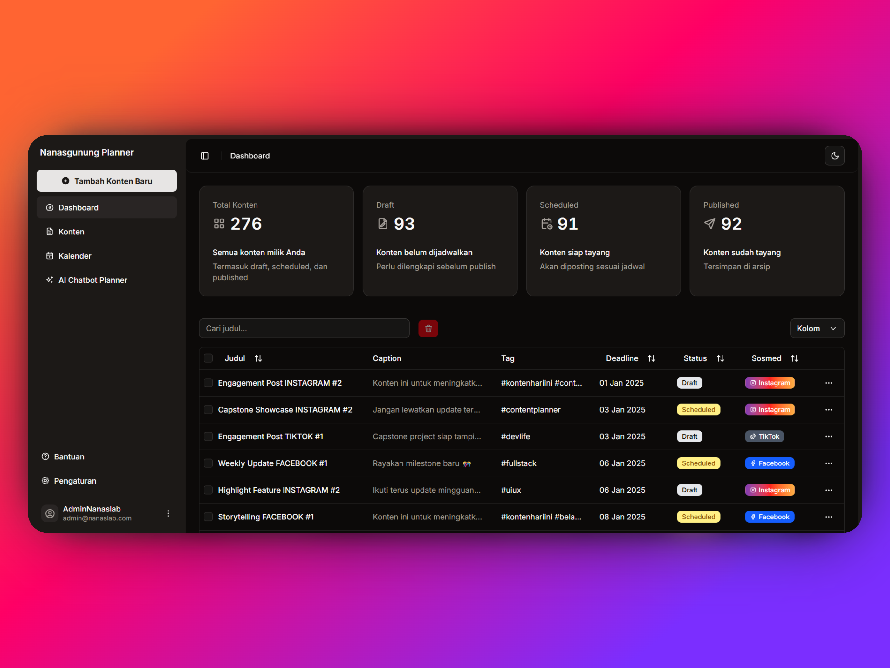
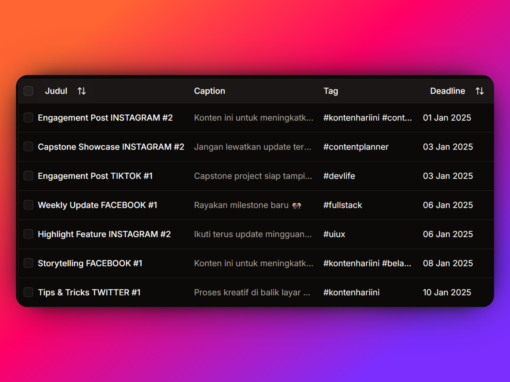
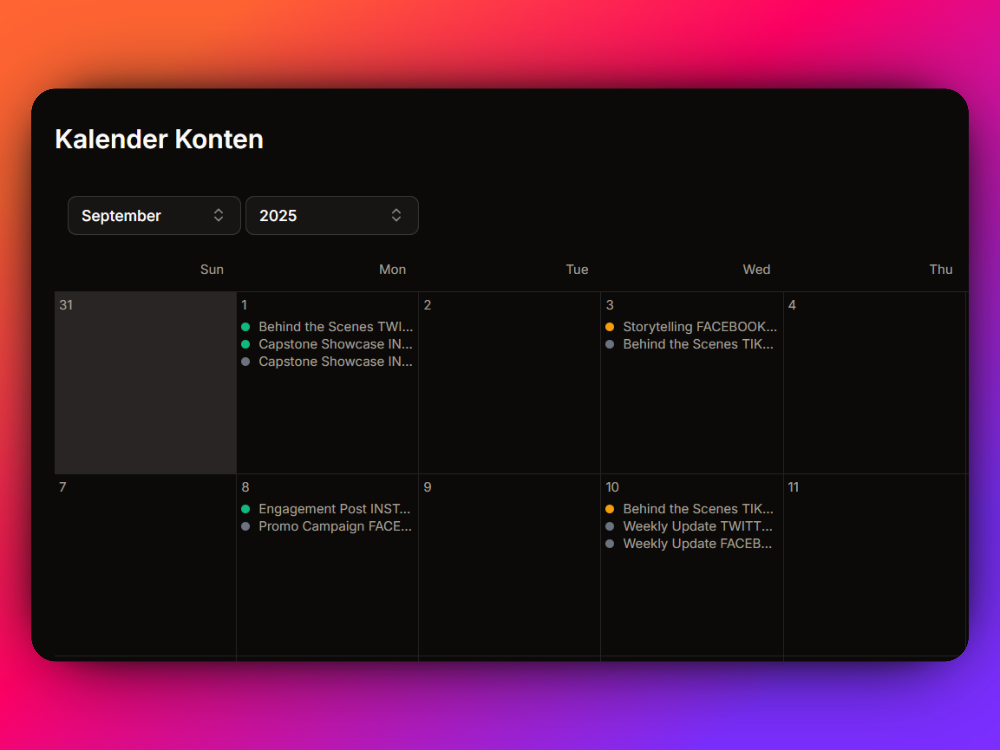
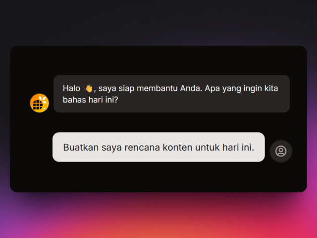
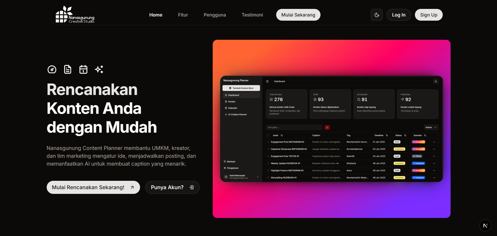
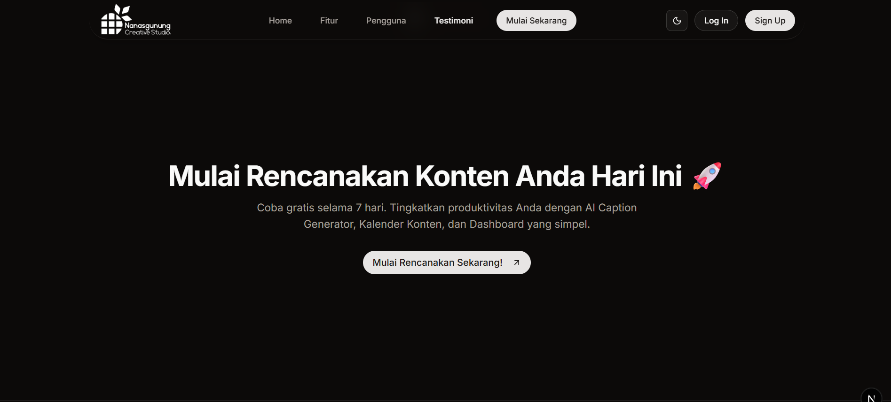

# Nanasgunung Content Planner

Perencana konten sosial media berbasis web untuk membantu UMKM, kreator, dan tim marketing kecil mengatur ide, menjadwalkan, dan mengelola konten dengan lebih efisien.  
---

## 📌 Project Overview
Banyak UMKM dan kreator kesulitan konsisten membuat dan mempublikasikan konten karena keterbatasan waktu, ide, dan tools.  
**Nanasgunung Content Planner** hadir sebagai solusi sederhana dengan fitur inti: dashboard konten, kalender visual, CRUD konten untuk memudahkan pengguna dalam menyimpan rencana konten di media sosial.  

**Tujuan proyek:**
- Membantu user menjaga konsistensi posting. (Konten sering tidak terjadwal → posting tidak konsisten.)
- Mempermudah pembuatan caption & hashtag. (Caption/hashtag sulit dibuat → engagement rendah.)
- Menyediakan workflow konten yang rapi dan mudah dipahami.

---

## 🛠️ Technologies Used
- **Frontend:** Next.js (React, App Router)  
- **Styling:** Tailwind CSS v4 (configless), shadcn/ui  
- **Backend:** Next.js API Routes (in-memory demo; Prisma optional untuk DB)  
- **Deployment:** Vercel (alternatif: Netlify / Firebase Hosting)  
- **IBM Granite Instruct/Code** → membantu generate dan refine code, memberikan ide dan saran.  

**Alasan pemilihan teknologi:**
- **Next.js** → framework modern yang cepat untuk membangun MVP, mendukung SSR/SSG, serta sudah familiar bagi developer sehingga mempercepat proses pengembangan.
- **Tailwind + shadcn/ui** → styling cepat, konsisten, dan modern.
- **Supabase** → menyediakan Postgres database, autentikasi siap pakai, yang mudah diintegrasikan tanpa setup server rumit. Cocok untuk set up website demo/hobby yang membutuhkan database. 
- **Vercel** → integrasi yang mudah dengan Next.js, mudah untuk demo.

---

## ✨ Features
- **Dashboard Konten** → ringkasan draft, scheduled, published + tabel konten.
  
- **Create/Edit Konten** → form judul, caption, hashtag, deadline, platform.
  
- **Kalender Planner** → drag & drop konten ke tanggal, visualisasi jadwal posting.
  
- **AI Chatbot** → halaman brainstorming ide konten, tren, dan campaign.
  

---

## 📄 Landing Page

Selain aplikasi inti, proyek ini juga meyertakan **landing page ala SaaS** untuk memperkenalkan Nanasgunung Content Planner.  
Landing page ini menjadi **pintu masuk utama** bagi calon pengguna, dengan struktur modern yang terdiri dari:

- **Hero Section** → headline singkat, subheadline, dan CTA (Call to Action).  
- **Kenapa Memilih Nanasgunung Planner** → menampilkan keunggulan utama seperti kalender visual, AI Assistant, dashboard yang ringkas.  
- **Siapa yang Bisa Menggunakan** → ditujukan untuk UMKM, kreator konten, dan tim marketing kecil.  
- **Testimoni** → social proof dummy untuk memperkuat kepercayaan pengguna.  
- **Call to Action (CTA)** → ajakan mencoba aplikasi secara langsung.  
- **Footer** → navigasi cepat dan identitas brand.

 

---

## ⚙️ Setup Instructions
1. Clone repository:
   ```bash
   git clone https://github.com/username/nanasgunung-planner.git
   cd nanasgunung-planner
2. Install Dependencies:
   ```bash
   npm install
3. Jalankan Server Lokal:
   ```bash
   npm run dev
4. Build untuk Production
   ```bash
   npm run build
   npm start
   
## 🤖 AI Support Explanation

- **Saat development:**  
  Saya menggunakan **IBM Granite Instruct** untuk mempercepat proses pengembangan. AI membantu saya dalam:
  - Refine dan generate potongan kode (komponen UI, struktur CRUD, logika API).  
  - Memberi inspirasi desain UX, misalnya pemisahan AI Chatbot (brainstorming) dan AI Assistant dalam code generation.  

- **Di aplikasi (untuk pengguna):**  
  AI diintegrasikan sebagai **fitur brainstorming konten**.  
  - Pengguna dapat membuka halaman **AI Chatbot** untuk mencari ide konten, tren, atau campaign.  
  - Fitur ini memudahkan pengguna yang sering kesulitan mencari ide atau menyusun kata-kata.  

- **Dampak nyata:**  
  - **Bagi saya (developer):** mempercepat coding, dokumentasi, dan perancangan fitur.  
  - **Bagi pengguna:** mempermudah proses brainstorming dan pembuatan konten sehingga workflow lebih efisien.  

- **Relevansi:**  
  Sesuai instruksi capstone, AI memang digunakan untuk mempercepat pengembangan. Namun saya juga menambahkan integrasi AI di aplikasi agar pengguna bisa merasakan manfaat langsung dalam konteks perencanaan konten.
